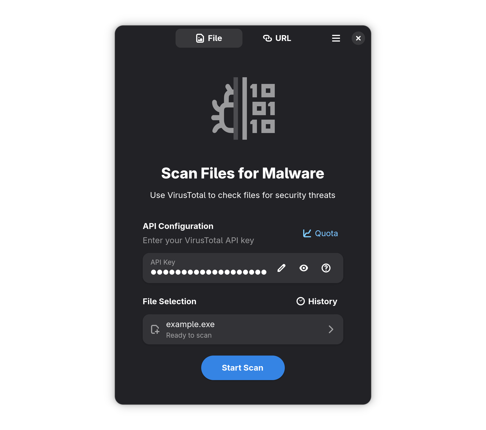

  
  <h1 align="center">Lenspect</h1>
  
<i>Lenspect</i> is a lightweight security threat scanner powered by <a href="https://www.virustotal.com">VirusTotal</a>.

  
  
  
  

  

## Installation

The recommended installation method is via <a href="https://flatpak.org">Flatpak</a>.

  

## Building from source

### GNOME Builder

The recommended method is to use GNOME Builder:

1. Install [`org.gnome.Builder`](https://gitlab.gnome.org/GNOME/gnome-builder) from Flathub.
2. Open Builder and select `Clone Repository`.
3. Clone `https://github.com/vmkspv/lenspect.git`.
4. Press `Run Project` at the top once project is loaded.

### Flatpak

You can also build the actual code as Flatpak:

1. Install [`org.flatpak.Builder`](https://github.com/flatpak/flatpak-builder) from Flathub.
2. Clone `https://github.com/vmkspv/lenspect.git` and `cd lenspect`.
3. Run `flatpak run org.flatpak.Builder --install --user --force-clean build-dir io.github.vmkspv.lenspect.json`.

## Contributing

Contributions are welcome!

If you have an idea, bug report or something else, don’t hesitate to [open an issue](https://github.com/vmkspv/lenspect/issues).

> This project follows the [GNOME Code of Conduct](https://conduct.gnome.org).

## License

Lenspect is released under the [GPL-3.0 license](COPYING).
